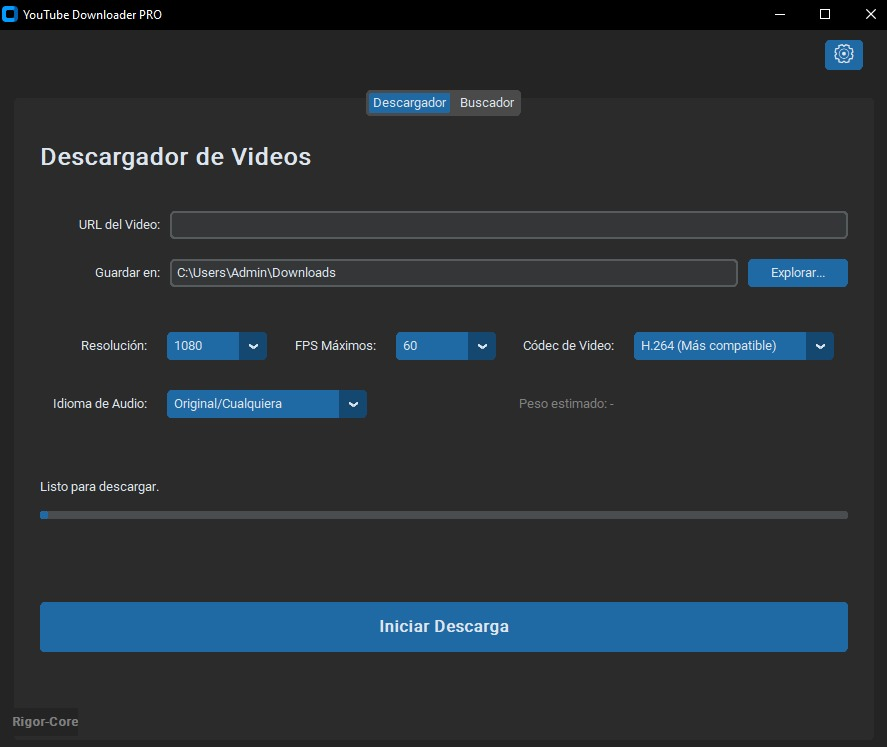
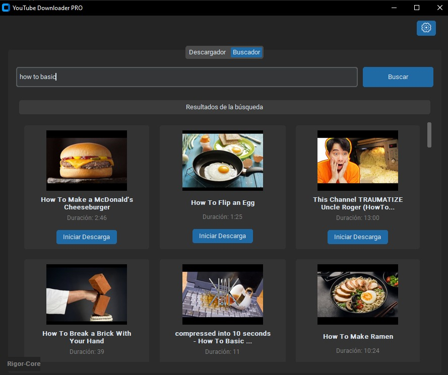

<div align="center">
  <h1>YouTube Downloader PRO 🎥</h1>
  <p>Una aplicación de escritorio rápida, moderna y en múltiples idiomas para descargar videos y audios de YouTube con la máxima calidad.</p>
</div>


*Interfaz principal del descargador.*


*Buscador integrado súper veloz.*

---

## 🚀 Características Principales

- **Descarga de Alta Calidad**: Soporte para resoluciones desde 144p hasta 1080p a 60 FPS.
- **Selección de Códecs**: Elige entre H.264 (mayor compatibilidad) o VP9 (mejor compresión/calidad).
- **Soporte Multilenguaje**: Configura la interfaz en Español, Inglés, Francés, Portugués o Ruso desde el menú de la tuerca ⚙️. Las búsquedas en YouTube se adaptarán a la ubicación e idioma seleccionados.
- **Pistas de Audio Dinámicas**: Selecciona audios localizados y doblajes originales (si el video los incluye) antes de realizar la descarga.
- **Buscador Rápido Integrado**: Busca videos directamente desde la aplicación sin necesidad de abrir el navegador web.
- **Cancelación Segura**: Puedes detener cualquier progreso de forma rápida en caso de error.

---

## 📦 Método 1: Descargar el Ejecutable (.exe) 

Si no quieres lidiar con instalaciones de Python ni librerías, en la sección de **[Releases](https://github.com/tu-usuario/tu-repositorio/releases)** puedes descargar directamente el archivo **`.exe`**. 

1. Ve a **Releases** en este repositorio.
2. Descarga el archivo `YouTubeDownloaderPRO.exe`.
3. Ejecútalo y listo, no se necesita instalar nada adicional.

> **Próximamente**: *El archivo .exe será añadido en breve.*

---

## 🛠️ Método 2: Instalación para Desarrolladores (Python)

Si deseas ejecutar el código fuente o modificar la aplicación por tu cuenta, sigue estos pasos:

### 1. Requisitos Previos
Asegúrate de tener instalado [Python 3.10+](https://www.python.org/downloads/) en tu sistema y de incluirlo en el PATH durante la instalación.

Además, necesitarás tener instalado **FFmpeg** en tu sistema para poder fusionar el video y el audio de mayor calidad. Puedes descargarlo desde [aquí](https://ffmpeg.org/download.html) o usar un gestor de paquetes.

### 2. Clonar el repositorio
Abre tu terminal y clona el proyecto:
```bash
git clone https://github.com/tu-usuario/youtube-downloader-pro.git
cd youtube-downloader-pro
```

### 3. Instalar Dependencias
Instala los requerimientos que aparecen en el entorno de desarrollo:
```bash
python -m pip install -U yt-dlp customtkinter pillow threading
```

### 4. Ejecutar la Aplicación
Inicia la app ejecutando el archivo principal:
```bash
python run.py
```

---

## 🧰 Tecnologías Usadas
- [Python 3](https://www.python.org/) - Lenguaje base.
- [CustomTkinter](https://github.com/TomSchimansky/CustomTkinter) - Interfaz Gráfica (GUI) moderna por encima de tkinter estándar.
- [yt-dlp](https://github.com/yt-dlp/yt-dlp) - Herramienta CLI especializada en la extracción rápida de metadatos y descargas directas de YouTube.

---

## 🤝 Contribuciones
¡Las contribuciones son bienvenidas! Si encuentras algún error o quieres sugerir alguna mejora visual/opción, siéntete libre de abrir un *Issue* o mandar un *Pull Request*.
